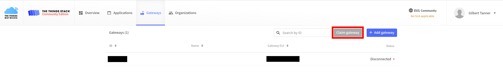
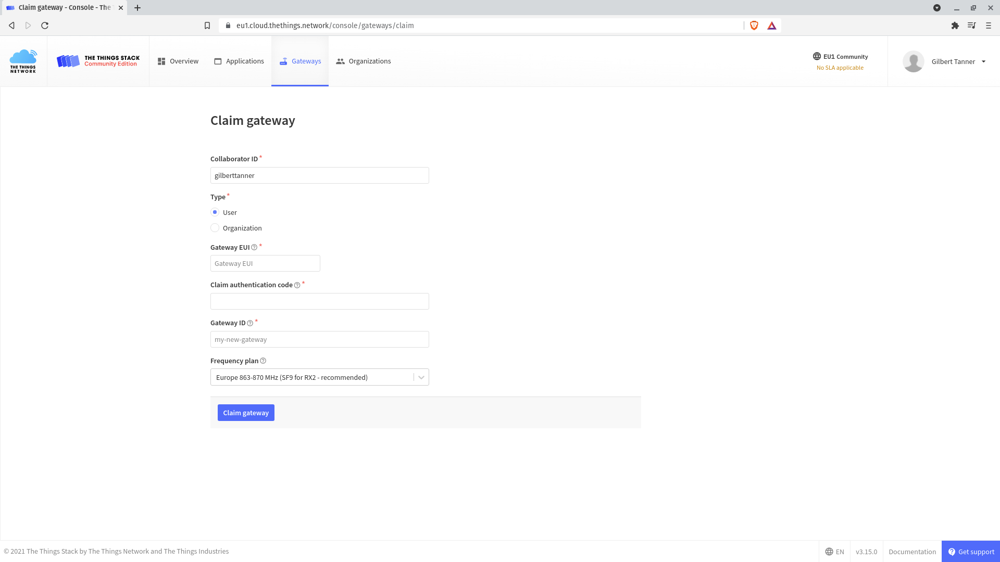
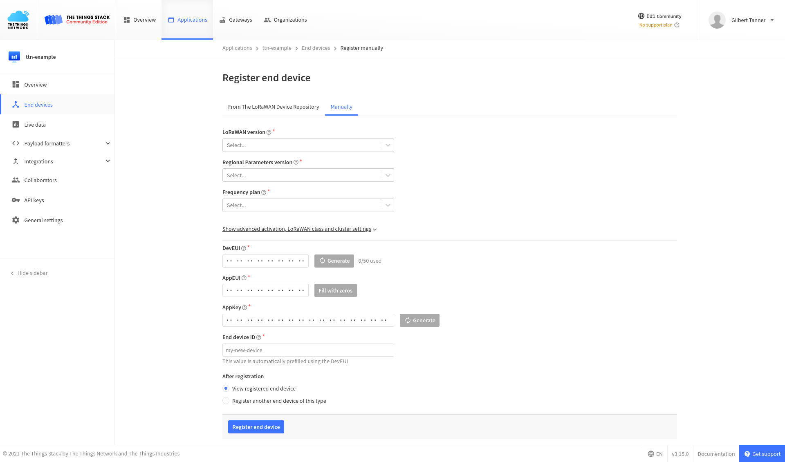
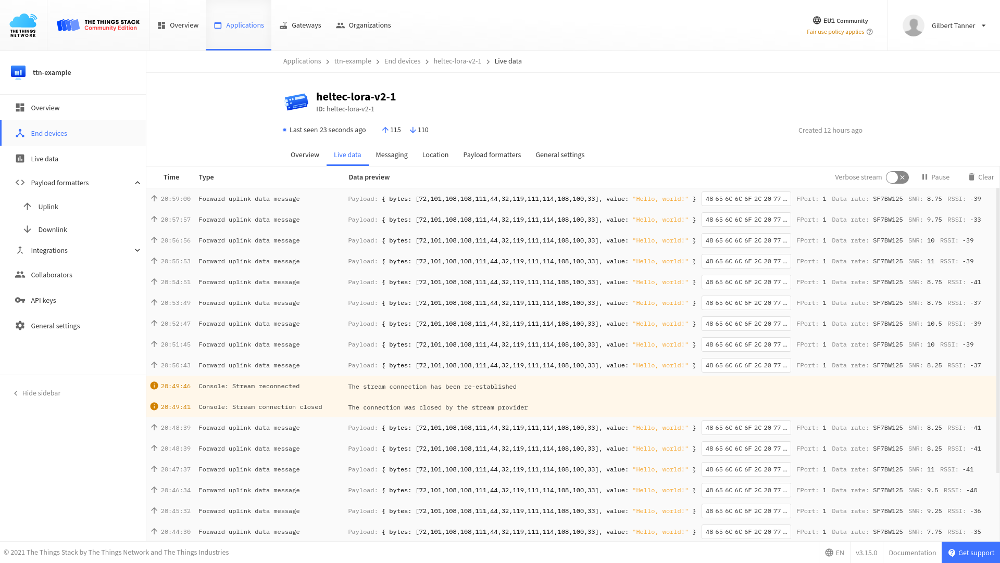

# Getting started with LoraWAN and The Things Stack

> The LoRaWAN® specification is a Low Power, Wide Area (LPWA) networking protocol designed to wirelessly connect battery operated 'things' to the internet in regional, national or global networks, and targets key Internet of Things (IoT) requirements such as bi-directional communication, end-to-end security, mobility and localization services. - [Lora Alliance](https://lora-alliance.org/about-lorawan)

[The Things Stack (TTS)](https://www.thethingsindustries.com/) is a project dedicated to building an open, free, and decentralized internet of things network.

## Creating a The Things Network Account


To create a The Things Network Account navigate to https://www.thethingsnetwork.org/ and click on the "Sign up" button. After that, you'll need to enter a username, email, and password. Be sure to enter a good username since you won't be able to change it after creating the account. 

## Adding a gateway

> Gateways form the bridge between devices and The Things Stack. Devices use low power networks like LoRaWAN to connect to the Gateway, while the Gateway uses high bandwidth networks like WiFi, Ethernet or Cellular to connect to The Things Stack. All gateways within reach of a device will receive the device's messages and forward them to The Things Stack. The network will deduplicate the messages and select the best gateway to forward any messages queued for downlink. A single gateway can serve thousands of devices. - [TTS Gateway documentation](https://www.thethingsindustries.com/docs/)

If there already is a gateway within reach, you won't need to buy one yourself since all gateways within reach of a device will receive and forward messages.

### The Things Indoor Gateway

For my tests, I used the [The Things Indoor Gateway (TTIG)](https://www.thethingsindustries.com/docs/gateways/thethingsindoorgateway/), an eight-channel LoRaWAN gateway with LBT support, which is available for $69.


#### Buying The Things Indoor Gateway

**Links:**
* RS Components - [link](https://uk.rs-online.com/web/p/radio-frequency-development-kits/1843981/)
* Connected Things - [link](https://connectedthings.store/gb/lorawan-gateways/the-things-indoor-gateway-868-mhz.html)
* IoT Shop - DE - [link](https://iot-shop.de/produkt/the-things-indoor-gateway)
* Allied Electronics - [link](https://www.alliedelec.com/product/rs-components-uk/ttig-915/71600476/)

There are also lots of other gateways. For an extensive list, check out the hardware section of the TTS [gateway documentation](https://www.thethingsindustries.com/docs/gateways/).

### Connecting the gateway to your WiFi (from the [TTS docs](https://www.thethingsindustries.com/docs/gateways/thethingsindoorgateway/#connecting-the-things-indoor-gateway))

1. Press the reset button (small button at the back of the gateway next to the USB-C port) for 5 seconds until the LED blinks rapidly GREEN<->RED for a couple of times.
2. Hold the SETUP (button at the top of the gateway, next to the LED) for 10 seconds until the LED blinks rapidly in RED.
3. The gateway now exposes a WiFi AP whose SSID is MINIHUB-xxxxxx where xxxxxx is the last 6 digits of the gateway ID.
4. The password for this network is printed on the back panel of the device under WiFi PW.
5. After connecting to this network, go to 192.168.4.1 using a web browser to access the WiFi config page.
6. Select the WiFi network and enter the password if it's a closed network.
7. Select the "Save and Reboot" option.
8. If your config is right,
    * The gateway will blink GREEN for a few seconds while it connects to this network.
    * Then, it will blink GREEN<->RED for a few seconds while it connects to the CUPS endpoint and fetches the necessary information to connect to the LNS traffic endpoint.
9. If your configuration was successful, the LED will be solid GREEN which means that the gateway is connected to the LoRaWAN network and is ready to handle packets.

### Connection to the TTS Backend

Now that your gateway is connected to the LoraWAN network, you can register it inside TTS. For this, navigate to the [**gateways** page](https://console.thethingsnetwork.org/gateways) and click the "**Claim gateway**" button.



Fill in the **Gateway EUI**, the **Claim authentication code** (the WiFi Password on the back of your TTS Indoor Gateway), the **Gateway ID**, and choose the appropriate Frequency Plan for your region and device. The EUI of the gateway is derived from the first number below the QR code on the back of the TTS Indoor Gateway. To get the 8 byte EUI insert FFFE after the first 6 characters. The EUI can also be found at the bottom of the WiFi Setup page.



After you're finished, click the "**Claim gateway**" button. If your inputs are correct, a new gateway will be created, and you'll be redirected to the gateway overview page, showing you some basic information about the gateway as well as the live traffic of the gateway.


If you don't have any nodes yet, don't worry. You'll learn how to create an application and add a node in the next sections.

## Creating an application

To create an application, go to **Applications** in the top menu, and click **Add Application** to get to the application registration page. Then, fill in the application id (all other fields are optional).


After clicking on the "**Create application**" button, you'll be redirected to the application overview page.


## Registering a device

Now that you've created an application, you can add end devices to the application by going to **End devices** in the left menu and clicking on the "**Add end device**" button to reach the end device registration page.


### Using the LoRaWAN Device Repository

The LoRaWAN device repository contains device profiles, LoRaWAN information, codecs, and more, for many LoRaWAN devices. Using the device repository to add devices in The Things Stack automatically uses the correct LoRaWAN version and regional parameters version, which means less information for you to find yourself.


### Manually Registering an End Device

If your device is not in the device repository, like if you're using the RFM95 Lora module in combination with an ESP32, you may manually register it.



For more information, read the ['Manually Register an End Device' section](https://www.thethingsindustries.com/docs/devices/adding-devices/#manually-registering-an-end-device) of the [The Things Stack documentation](https://www.thethingsindustries.com/docs/).

## Install arduino-lmic

LMiC (formerly 'LoRa MAC in C') is IBM's LoRa library. [Arduino-LMIC](https://github.com/mcci-catena/arduino-lmic) contains the IBM LMIC (LoraMAC-in-C) library, slightly modified to run in the Arduino environment, allowing using the SX1272, SX1276 transceivers, and compatible modules (such as some HopeRF RFM9x modules).

To install the library:
* go to **Sketch > Include Library > Manage Libraries** and search for lmic and install the **MCCI LoRaWAN LMIC Library** library.

## Configure library

The default frequency band used in the **MCCI LoRaWAN LMIC Library** library is 915MHz, which works for the US and Austrialia. If you're in a different region you'll have modify the `lmic_project_config.h` file, which can be found in the `project_config` folder of the library. To change the frequency band just uncomment the line with your region:

EU:
```c
// project-specific definitions
#define CFG_eu868 1
//#define CFG_us915 1
//#define CFG_au915 1
//#define CFG_as923 1
//#define LMIC_COUNTRY_CODE LMIC_COUNTRY_CODE_JP	/* for as923-JP */
//#define CFG_kr920 1
//#define CFG_in866 1
#define CFG_sx1276_radio 1
//#define LMIC_USE_INTERRUPTS
```

## Creating a sender script

The LMIC library includes multiple scripts to communicate with The Things Stack, which can be accessed under **Examples > MCCI LoRaWAN LMIC Library**. In this guide, we'll use the `ttn_abp` script.

To get the script to work, you have to enter the **Network Session Key**, **App Session Key**, and **Device Address** from the Overview tab of the device. You'll also have to update the **lmic_pinmap lmic_pins** variables depending on what microcontroller and LoRa module you're using.

For the Heltect ESP32 Lora (V2) the pins look as follows

```c
const lmic_pinmap lmic_pins = {
  .nss = 18,
  .rxtx = LMIC_UNUSED_PIN,
  .rst = 14,
  .dio = {26, 34, 35},
};
```

After uploading the script, the device should print something similar to the following output on the Serial Monitor.


You should also now be able to see the send data in the **Data tab** of the Application or Device page.


## Encoding/Decoding data

LoraWAN and TTS transfer raw bytes, which can be hard to read. To convert the data into a plaintext string you need to add a **Payload formatter** to your application.

```javascript
function decodeUplink(input) {
  return {
    data: {
      bytes: input.bytes,
      value: String.fromCharCode.apply(null, input.bytes)
    },
    warnings: [],
    errors: []
  };
}
```



## Gateway data retrieval over MQTT

Now we are receiving the data in TTS, but how can we get the data from TTS? TTS lets you get the data over MQTT, an extremely lightweight machine-to-machine(M2M) connectivity protocol using a publish/subscribe model.

In the following examples, I'll show you how to receive data using [Mosquitto's CLI](https://mosquitto.org/download/), but TTS also provides libraries for multiple programming languages, including Java, Node.js, and Python. For more information, check out the [Integrations with MQTT Clients section in the documentation](https://www.thethingsindustries.com/docs/integrations/mqtt/mqtt-clients/).

### Subscribing to Upstream Traffic

The Application Server publishes uplink traffic on the following topics:
* `v3/{application id}@{tenant id}/devices/{device id}/join`
* `v3/{application id}@{tenant id}/devices/{device id}/up`
* `v3/{application id}@{tenant id}/devices/{device id}/down/queued`
* `v3/{application id}@{tenant id}/devices/{device id}/down/sent`
* `v3/{application id}@{tenant id}/devices/{device id}/down/ack`
* `v3/{application id}@{tenant id}/devices/{device id}/down/nack`
* `v3/{application id}@{tenant id}/devices/{device id}/down/failed`
* `v3/{application id}@{tenant id}/devices/{device id}/service/data`
* `v3/{application id}@{tenant id}/devices/{device id}/location/solved`

You can either subscribe to topics separately, or you can subscribe to all topics by using `#`.

```bash
mosquitto_sub -h thethings.example.com -t "#" -u "<AppID>" -P "<AppKey>" -d
```

> Don't forget to replace, \<AppID>, \<AppKey> with the right values for your application. You can find them in the Overview tab of your application.

If you only want to get a specific field, you can write the field's name after the topic.

```bash
mosquitto_sub -h thethings.example.com -t '+/devices/+/up/led' -u '<AppID>' -P '<AppKey>' -d
```

### Publishing Downlink Traffic

MQTT can also be used to send messages to TTS. For this, you will have to address a specific device by its **Device ID**.

```
mosquitto_pub -h <Region>.thethings.network -t "v3/<AppID>/devices/<DevID>/down/push" -u "<AppID>" -P "<AppKey>" -m "{""payload_fields"":{""led"":true}} -d"
```